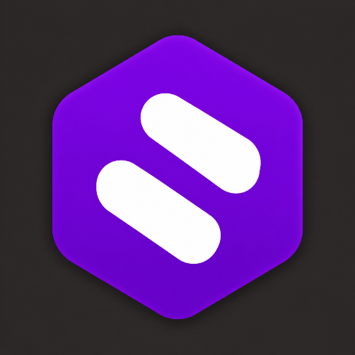
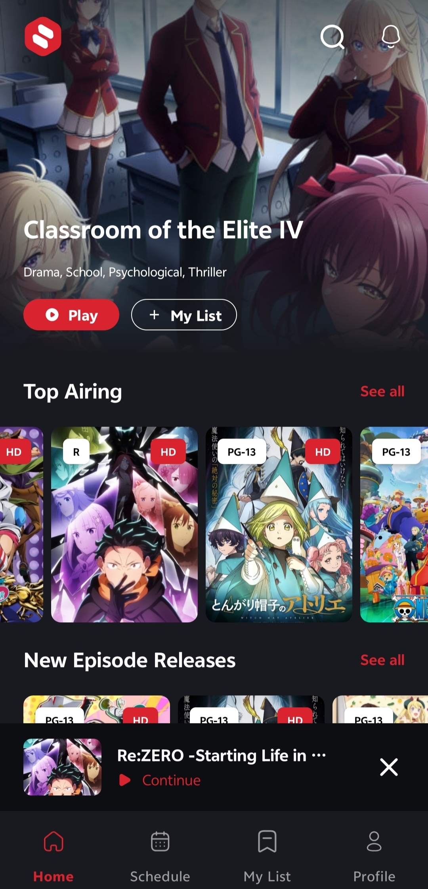
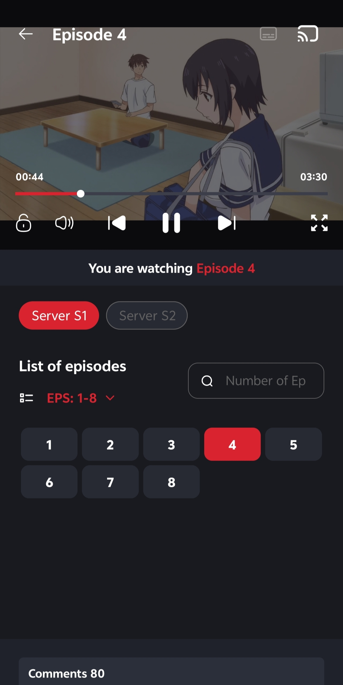

 

  

<!-- Download APK – smaller width -->

 

<!-- Telegram join – same width as download -->

  

<!-- Stats box -->
<table border="1" bordercolor="#26A5E4" cellpadding="8" style="border-collapse:collapse; margin-left:auto; margin-right:auto;">
  <tr>
    <td align="center">
      
      &nbsp;
      
      &nbsp;
      
    </td>
  </tr>
</table>

## ✅ Mod Features

| 🔥 Feature | Status |
|---|---|
| 🚫 Ads Removed | ✔️ |
| 🛡️ Trackers Disabled | ✔️ |
| ⚡ SPlayer Bypassed | ✔️ |
| 🎨 New App Icon | ✔️ |
| 🚀 Optimized Performance & Stability | ✔️ |
| ✨ Cleaner UI Experience | ✔️ |

> 🎌 Enjoy smooth anime streaming without unnecessary interruptions.

## 📸 Screenshots

| Home | Player |
|:---:|:---:|
|  |  |

## ⚠️ Installation Guide

1. Download the APK from the button above
2. Enable **"Install from Unknown Sources"** in settings
3. Install the APK
4. Open app & enjoy smooth anime streaming! ✨

Modded with ❤️ by <a href="https://github.com/koushik-01-exe">koushik-01-exe</a> • <a href="https://t.me/BankaiMods">@BankaiMods</a>

